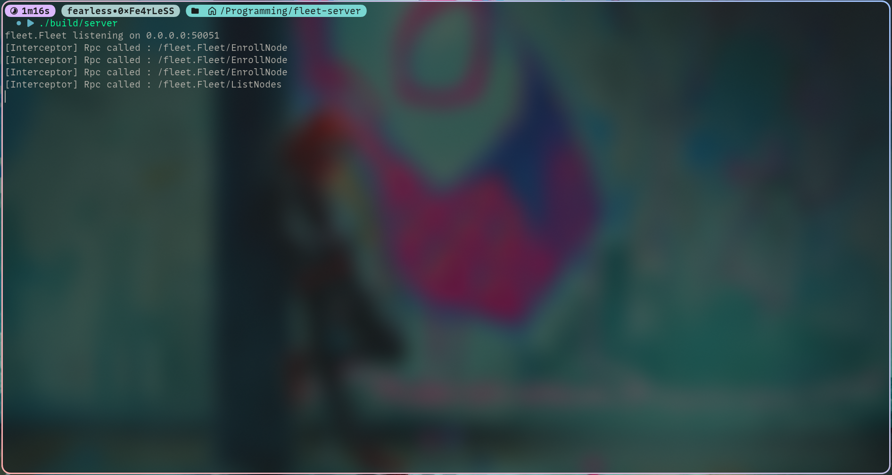
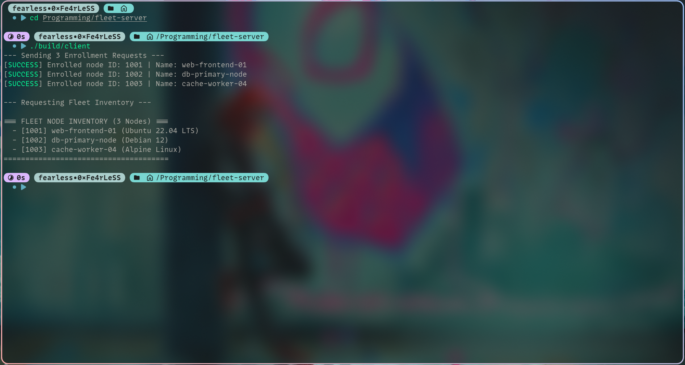

# 🚀 Fleet Server (gRPC)

A minimal, scalable microservice template built with modern C++17 and gRPC. This project implements a central registry to enroll and list network nodes, serving as a clean architectural foundation for native C++ backend services.

> The fleet-server is located here: ``

## 📁 Architecture

This project follows a structure inspired by production-grade microservice patterns:

```
fleet-server/
├── scripts/         # Shell scripts for code generation
├── protos/          # The source for the API contract
├── include/         # Header files (Declarations)
└── src/             # Source files (Implementations)
    ├── server/      # Network transport, interceptors, and gRPC config
    └── service/     # Pure business logic and in-memory storage
```

- **Decoupled Business Logic**: The service layer manages data and operations completely independent of how the server connects to the network.
- **Smart Memory Management**: Uses modern C++ `std::unique_ptr` and `std::shared_ptr` to ensure leak-free execution.
- **Thread Safety**: Implements `std::mutex` and `std::lock_guard` to safely handle highly concurrent asynchronous gRPC requests.


## ⚙️ Build Instructions

Generate the `Protobuf Code` by running the included shell script to compile the .proto file into C++ interfaces.

```zsh
chmod +x scripts/proto-gen.sh
./scripts/proto-gen.sh

```

Configure the CMake Environment

```zsh
cmake -S . -B build -DCMAKE_EXPORT_COMPILE_COMMANDS=ON
```

Build the server and client executables using all available CPU cores.

```zsh
cmake --build build -j$(nproc)
```


## 💻 Usage

The system consists of two separate executables.

1. Start the Server
Open a terminal and start the gRPC server. It will listen continuously on 0.0.0.0:50051. It features interceptors that will log incoming RPC calls.

```zsh
./build/server
```

> To stop the server, press Ctrl+C. A graceful shutdown handler will catch the signal and safely close the active connections.

2. Run the Client
In a second terminal, execute the client. It will automatically enroll three sample nodes and request the full fleet inventory.

```zsh
./build/client

```

Built as a scalable learning template for modern C++ networking.


## 🚀 Example

Following is an example of the running server.

| The Server | The Client |
| :---: | :---: |
|  |  |
